## Business Problem

The Banking, Financial Services and Insurance market players are generally bound by strict regulatory requirements. These players may need to make changes to their products, operating models based upon the changing regulations by the authorities. On the other other side, with every growing competition in the market is forcing the players to provide competitive pricing and launch new products which cater to changing consumer requirements. All of these changes either forced by the regulators or the market, demand that these organizations be very agile while making decisions while offering the products. 

### Example of Business Scenario

Lets take a basic example of two people going to bank to book fixed deposits as shown below
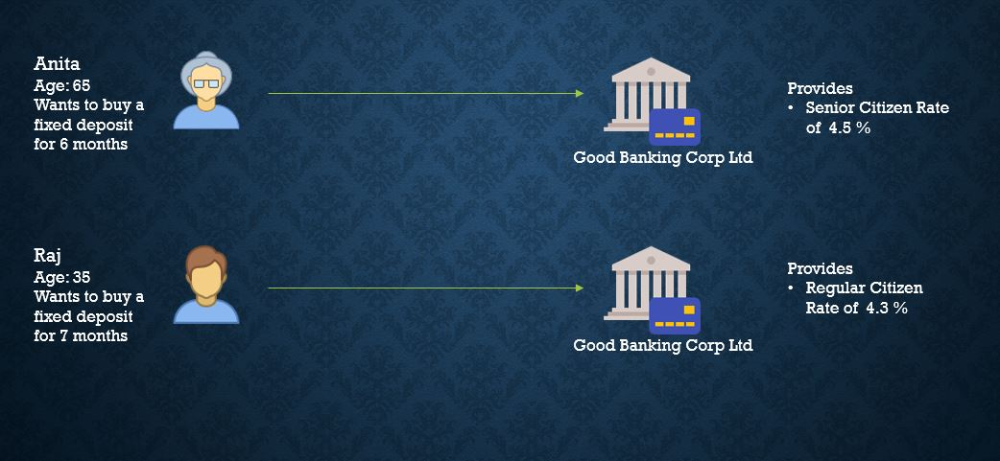

## An Imperative Solution

The rules for example above are implemented using the imperative programming model thus involving loops, sequential conditional evaluations as such. This approach is implemented as shown below in the crude `FDInterestCalculator` 

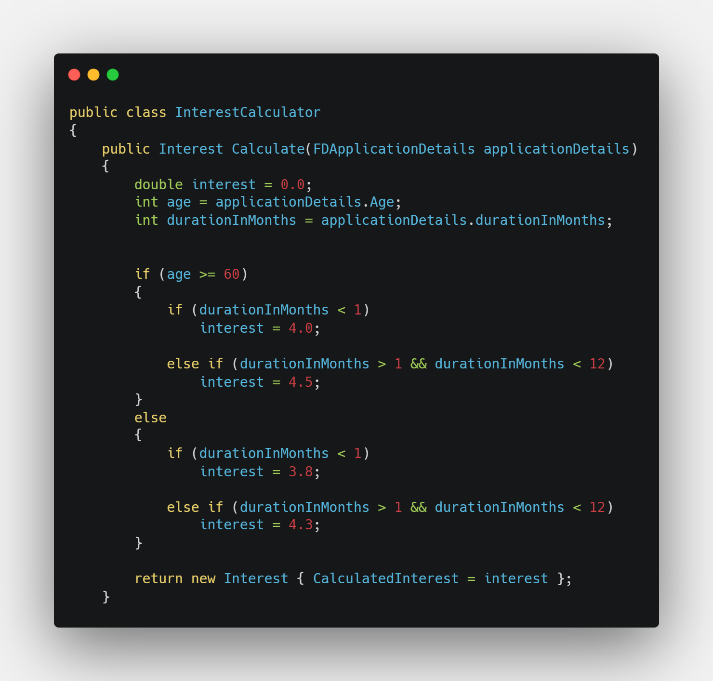

Adopting such imperative model can be good for smaller set of rules, but can limit the agility of the software release when the number of business rules in an application is very large. The main problem stems from the fact that the business rules are tightly coupled to the evaluation engine and a deployment will be needed every time a small change is made. Another glaring problem with this approach is the sheer number of lines of codes we have to write and the maintenance cost that comes with it. 

## An Alternative Solution

[Business Rules Engine](https://en.wikipedia.org/wiki/Business_rules_engine)(BRE) presents an alternative way of programming rules using the condition and action paradigm. Any condition when evaluated to true will produce certain side effect. The imperative implementation looks as below when written using the condition and action paradigm.

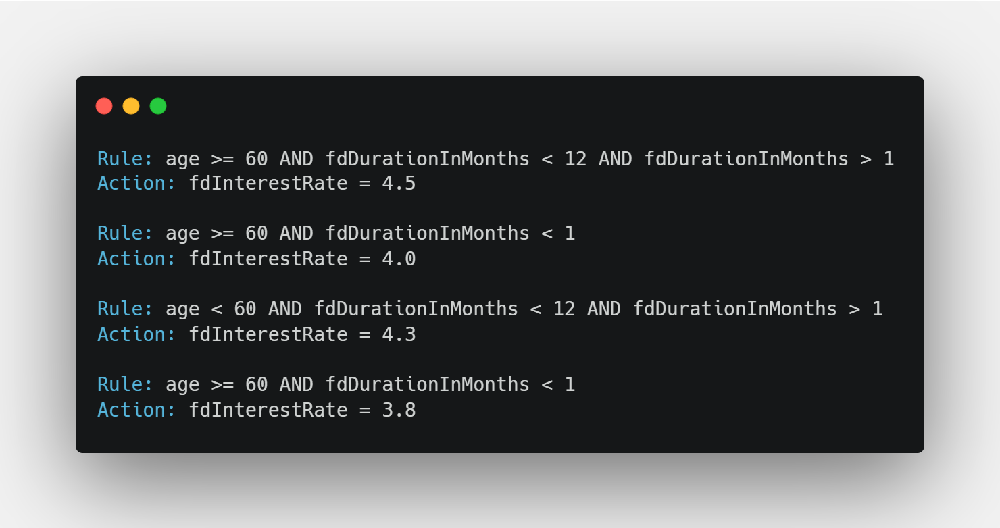

This approach presents advantage in the fact that the business rules can be decoupled from the engine or service implementation. Rules when coded using BRE are also easier to read and maintain.

## BRE Implementation

Let us now look at how to actually build a highly scalable rules engine system using Azure. 

### Tech Stack
I have decided to build the solution using following tech stack

| Library/Technology/Platform| Short Description|Reference|
|--------------|-------------|-----------------|
|Azure Functions V 4.0 with .Net 6.0| Azure functions is a cloud service available on demand that provides capability to run the custom made peices of code and the functions platform provides all latest and greatest in the infrastructure and security| [Azure Functions Documention](https://learn.microsoft.com/en-us/azure/azure-functions/)|
| Microsoft Rules Engine| Rules Engine is a library/NuGet package for abstracting business logic/rules/policies out of a system. It provides a simple way of giving you the ability to put your rules in a store outside the core logic of the system, thus ensuring that any change in rules don't affect the core system. | [Rules Engine Documentation](https://microsoft.github.io/RulesEngine/)|
| Fluent Validations| This library allows developers to write model validation rules in a fluent style.| [Fluent Validations Documentation](https://fluentvalidation.net/)|
|Blob Storage Library| This library allows developer to communicate with the azure blob storage|[Blob Storage Nuget Package](https://www.nuget.org/packages/Microsoft.Azure.Storage.Blob/)|
|Automapper| AutoMapper in C# is a library used to map data from one object to another. It acts as a mapper between two objects and transforms one object type into another.| [Automapper Documentation](https://automapper.org/)| 
|XUnit.net| XUnit.net is a free, community focused unit testing framework for the .NET framework| [XUnit.net Documentation](https://xunit.net/)|
|Fluent Assertions| Fluent Assertions present a cleaner way of writing assertions in the tests| [Fluent Assertions](https://fluentassertions.com/)|

### Architecture
Lets look at the architecture of the rules engine system that is being built.

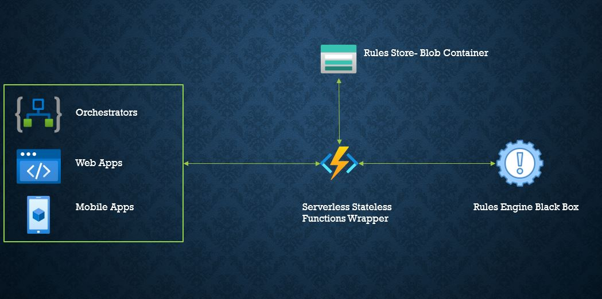

Following table provides the purpose of the use of particular components

|Component|Purpose|
|---------|-------|
|Rules Engine Black Box| This the the rules engine provided by the library noted in the teck stack. The rules engine is a black box and the system will pass it data and the rules configuration file and expect back the rules execution results|
|Rules Store - Blob Container| The configuration files which contain the business rules are stored in the blob container in a storage account. This allows us to decopule the rules from the system implementation. Any changes to the rules and we just update the rules configuration in the blob container.|
|Orchestrator - Azure Function| Azure function serves as the stateless wrapper over the rules engine black box. The azure function is exposed as a REST endpoint and accepts the data against which the rules are to be evaluated and pulls the rules configuration from the blob container and feeds it to the rules engine library to get the execution results, which are then conveyed back to the caller|

### Implementation

{}
* The azure function based rules engine system is built using Test Driven Development Approach and I personally follow the same approach for all projects where it is possible. You will find a lot of tests written for trivial functions but they are inlign with the `design through tests` paradigm of test driven development
* Azure function has a lot of bindings available which allow us to pull/push data in an opinionated manner, I prefer to write my interactions with the systems using interfaces and their concrete implementations
{}

This section will briefly describe key components and functions of the code. For more details on the implementation, please visit the source code provided in the Source Code section

#### Rules Configuration

The rules mentioned in the alternative approach can be coded as a workflow as defined by the Rules Engine Documentation. The rules when translated to JSON will look like below.
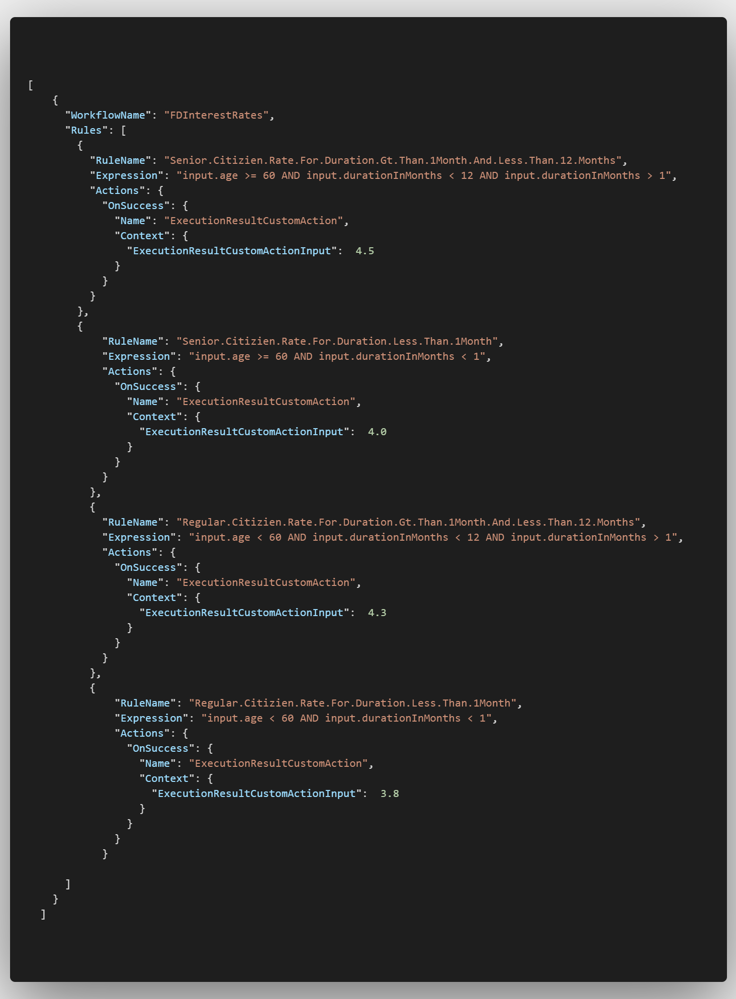

{}
A rules configuration file can contain multiple workflows,but I like to only put one workflow in a rules configuration to honor the single responsibility principle.
{}

#### Rules Engine Customization

As shown in the workflow above, I have created a custom action named `ExecutionResultCustomAction` which is configured to run when the condition of a rule is evaluated to true. The custom action is implemented as following([Read More](https://microsoft.github.io/RulesEngine/#custom-actions))

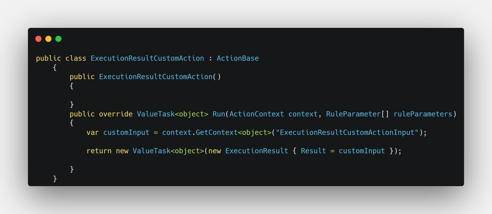
<!-- ```C#
public class ExecutionResultCustomAction : ActionBase
    {
        public ExecutionResultCustomAction()
        {

        }
        public override ValueTask<object> Run(ActionContext context, RuleParameter[] ruleParameters)
        {
            var customInput = context.GetContext<object>("ExecutionResultCustomActionInput");

            return new ValueTask<object>(new ExecutionResult { Result = customInput });

        }
    }

``` -->
The custom action reads the value defined in `ExecutionResultCustomActionInput` and parses it into an instance of `ExecutionResult` class


#### Rules Engine Handler

I have written a `IRulesEngineHandler` and its implementation `RulesEngineHandler` to interact with the rules engine SDK

The rules engine can be invoked using the implementation of `IRulesEngine`. It can be injected into the handler class using Dependency Injection as shwon below.

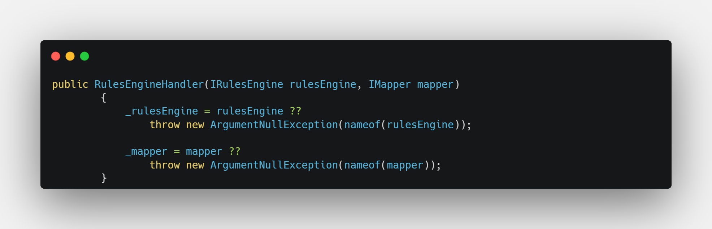
<!-- ```C#
public RulesEngineHandler(IRulesEngine rulesEngine, IMapper mapper)
        {
            _rulesEngine = rulesEngine ??
                throw new ArgumentNullException(nameof(rulesEngine));

            _mapper = mapper ??
                throw new ArgumentNullException(nameof(mapper));
        }
``` -->
The rules engine is invoked using the `ExecuteRulesAsync` method of  `RulesEngineHandler`

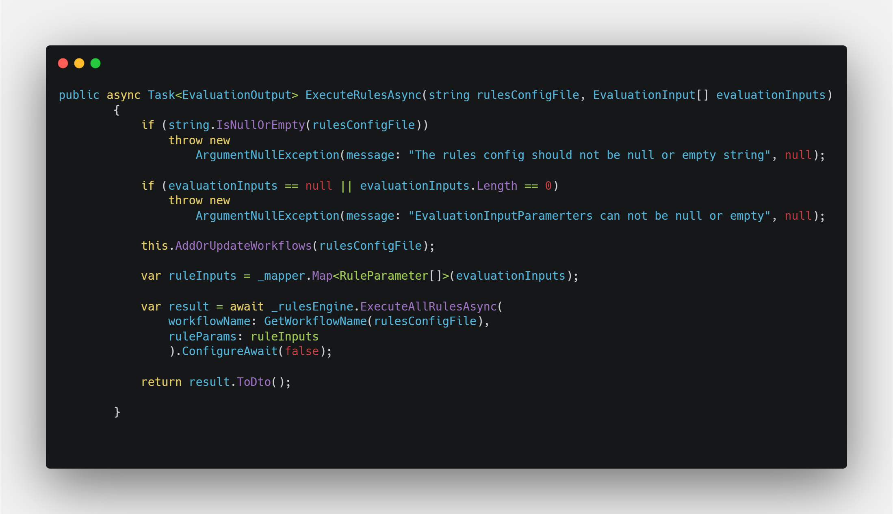
<!-- 
```C#
        public async Task<EvaluationOutput> ExecuteRulesAsync(string rulesConfigFile, EvaluationInput[] evaluationInputs)
        {
            if (string.IsNullOrEmpty(rulesConfigFile))
                throw new
                    ArgumentNullException(message: "The rules config should not be null or empty string", null);

            if (evaluationInputs == null || evaluationInputs.Length == 0)
                throw new
                    ArgumentNullException(message: "EvaluationInputParamerters can not be null or empty", null);

            this.AddOrUpdateWorkflows(rulesConfigFile);

            var ruleInputs = _mapper.Map<RuleParameter[]>(evaluationInputs);

            var result = await _rulesEngine.ExecuteAllRulesAsync(
                workflowName: GetWorkflowName(rulesConfigFile),
                ruleParams: ruleInputs
                ).ConfigureAwait(false);

            return result.ToDto();

        }
``` -->
The method
* Accepts the rules configuration json as string and an array of evaluation inputs on which the rules will be executed
* Runs certain sanity checks and throws execptions if they are not met
* Adds the workflow to the rules engine memory
* Maps the `evaluationInputs` to the inputs expected by the rules engine
* Evaluates the rules against the inputs
* And finally transforms the rules execution result to the `EvaluationOutput` and returns the response

The `result.ToDto()` uses an extension method defined specifically on the rules engine execution output. The implemented method is as follows
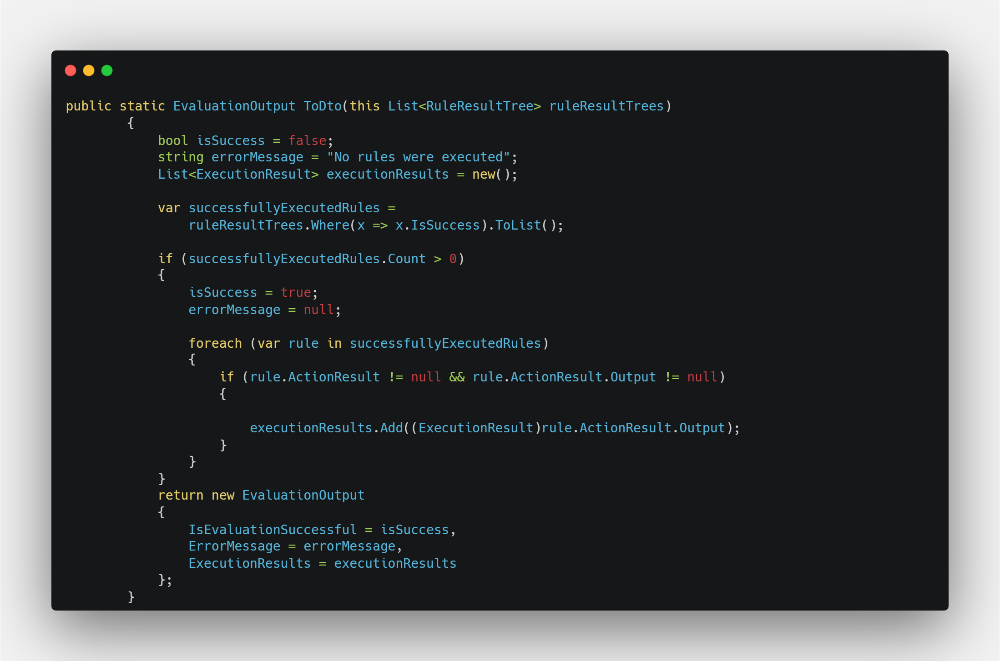
<!-- ```C#
public static EvaluationOutput ToDto(this List<RuleResultTree> ruleResultTrees)
        {
            bool isSuccess = false;
            string errorMessage = "No rules were executed";
            List<ExecutionResult> executionResults = new();

            var successfullyExecutedRules =
                ruleResultTrees.Where(x => x.IsSuccess).ToList();

            if (successfullyExecutedRules.Count > 0)
            {
                isSuccess = true;
                errorMessage = null;

                foreach (var rule in successfullyExecutedRules)
                {
                    if (rule.ActionResult != null && rule.ActionResult.Output != null)
                    {

                        executionResults.Add((ExecutionResult)rule.ActionResult.Output);
                    }
                }
            }
            return new EvaluationOutput
            {
                IsEvaluationSuccessful = isSuccess,
                ErrorMessage = errorMessage,
                ExecutionResults = executionResults
            };
        }
``` -->


### Rules Store Repository

I have selected the Azure Blob Storage to use as a rules store. The `BlobRulesStoreRepository` implements the mechanism to download the rules configuration.

The Blob Storage SDK allows us to connect to the blob storage through a `BlobContainerClient`, which can be configured at the runtime and then injected as shown below.
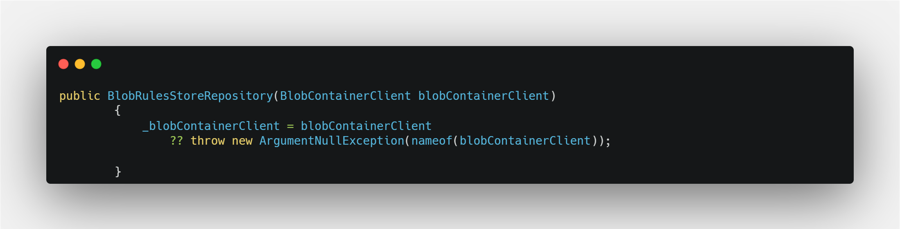

<!-- ```C#
public BlobRulesStoreRepository(BlobContainerClient blobContainerClient)
        {
            _blobContainerClient = blobContainerClient
                ?? throw new ArgumentNullException(nameof(blobContainerClient));

        }
``` -->
The `GetConfigAsStringAsync` methods shows how to connect to a blob container and retrieve the blob

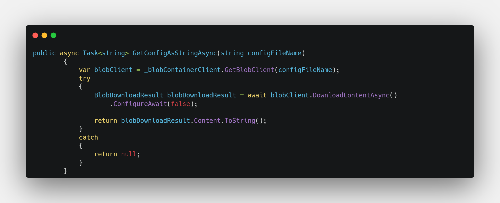

<!-- ```C#
public async Task<string> GetConfigAsStringAsync(string configFileName)
        {
            var blobClient = _blobContainerClient.GetBlobClient(configFileName);
            try
            {
                BlobDownloadResult blobDownloadResult = await blobClient.DownloadContentAsync()
                    .ConfigureAwait(false);

                return blobDownloadResult.Content.ToString();
            }
            catch
            {
                return null;
            }
        }
``` -->

### Azure Functions

The azure function serves as a stateless orchestrator for the rules configuration and rules execution. The logical flow of the azure function is depicted in below diagram.

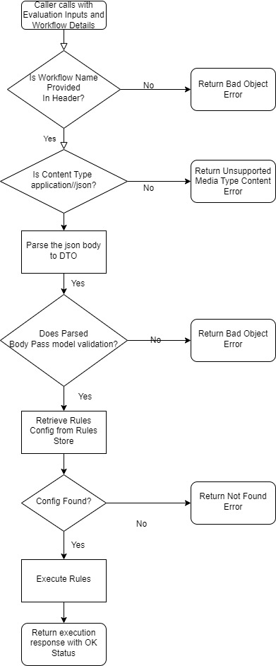

The azure function uses the dependency injection to inject the dependencies at the startup, all the dependencies required by the function are as shown below

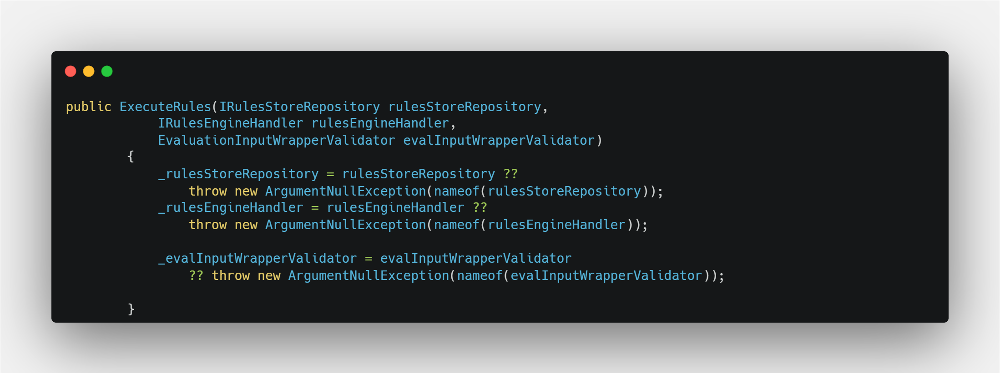

<!-- ```C#
 public ExecuteRules(IRulesStoreRepository rulesStoreRepository,
            IRulesEngineHandler rulesEngineHandler,
            EvaluationInputWrapperValidator evalInputWrapperValidator)
        {
            _rulesStoreRepository = rulesStoreRepository ??
                throw new ArgumentNullException(nameof(rulesStoreRepository));
            _rulesEngineHandler = rulesEngineHandler ??
                throw new ArgumentNullException(nameof(rulesEngineHandler));

            _evalInputWrapperValidator = evalInputWrapperValidator
                ?? throw new ArgumentNullException(nameof(evalInputWrapperValidator));

        }
        
``` -->

#### Request Model
The Azure function parses the incoming request into `EvaluationInputWrapper` class type
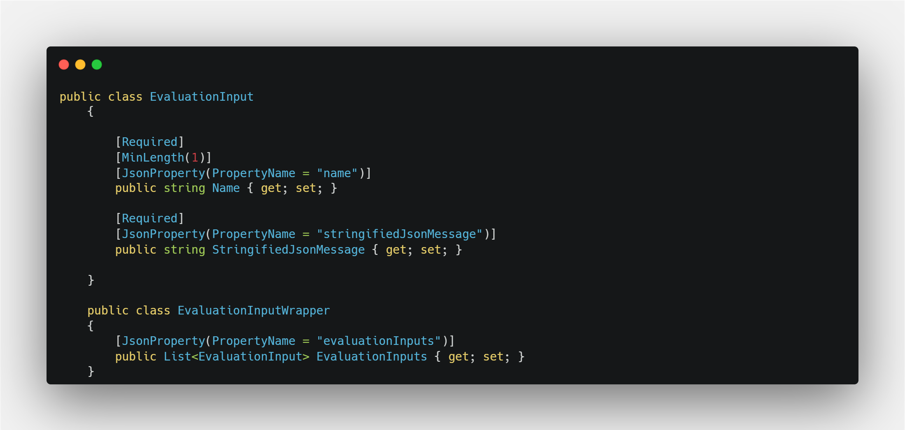

<!-- ```C#
public class EvaluationInput
    {

        [Required]
        [MinLength(1)]
        [JsonProperty(PropertyName = "name")]
        public string Name { get; set; }

        [Required]
        [JsonProperty(PropertyName = "stringifiedJsonMessage")]
        public string StringifiedJsonMessage { get; set; }

    }

    public class EvaluationInputWrapper
    {
        [JsonProperty(PropertyName = "evaluationInputs")]
        public List<EvaluationInput> EvaluationInputs { get; set; }
    }
``` -->
using following logic 

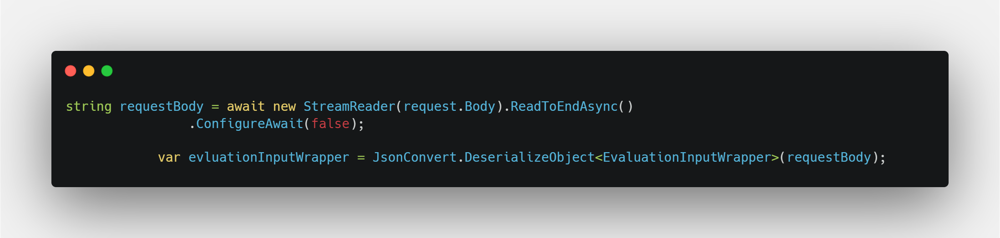

<!-- ```C#
 string requestBody = await new StreamReader(request.Body).ReadToEndAsync()
                .ConfigureAwait(false);

            var evluationInputWrapper = JsonConvert.DeserializeObject<EvaluationInputWrapper>(requestBody);

``` -->
#### Model Validation

The instance of `EvaluationInputWrapper` is validated using a Fluent Validation Based Validator defined as below

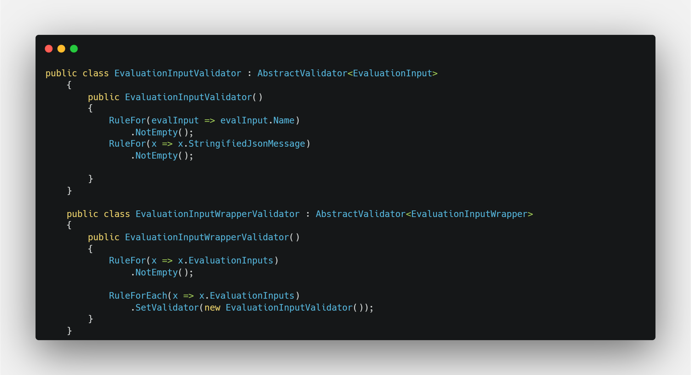

<!-- ```C#
 public class EvaluationInputValidator : AbstractValidator<EvaluationInput>
    {
        public EvaluationInputValidator()
        {
            RuleFor(evalInput => evalInput.Name)
                .NotEmpty();
            RuleFor(x => x.StringifiedJsonMessage)
                .NotEmpty();

        }
    }

    public class EvaluationInputWrapperValidator : AbstractValidator<EvaluationInputWrapper>
    {
        public EvaluationInputWrapperValidator()
        {
            RuleFor(x => x.EvaluationInputs)
                .NotEmpty();

            RuleForEach(x => x.EvaluationInputs)
                .SetValidator(new EvaluationInputValidator());
        }
    }
``` -->
The function calls this validator as 

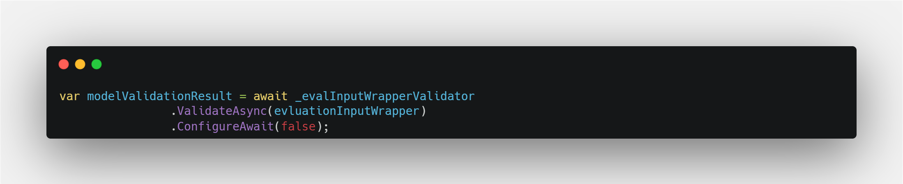

<!-- ```C#
 var modelValidationResult = await _evalInputWrapperValidator
                .ValidateAsync(evluationInputWrapper)
                .ConfigureAwait(false);
``` -->

#### Dependencies Registration

As shown above, the code uses the concept of dependency injection wherever possible. In order to register dependencies in Azure functions, we use the `Startup` class. Following code snippet shows how we can register various dependencies.

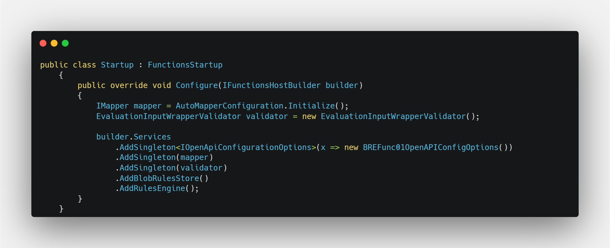
<!-- ```C#
public class Startup : FunctionsStartup
    {
        public override void Configure(IFunctionsHostBuilder builder)
        {
            IMapper mapper = AutoMapperConfiguration.Initialize();
            EvaluationInputWrapperValidator validator = new EvaluationInputWrapperValidator();

            builder.Services
                .AddSingleton<IOpenApiConfigurationOptions>(x => new BREFunc01OpenAPIConfigOptions())
                .AddSingleton(mapper)
                .AddSingleton(validator)
                .AddBlobRulesStore()
                .AddRulesEngine();
        }
    }

``` -->

The `AddBlobRulesStore` and `AddRulesEngine` are the implemented as extension methods on `IServiceCollection` as shown below.

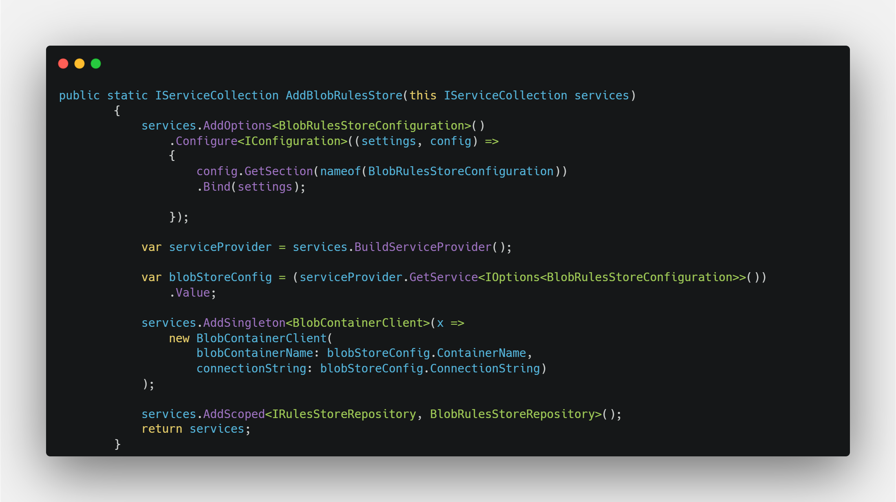 
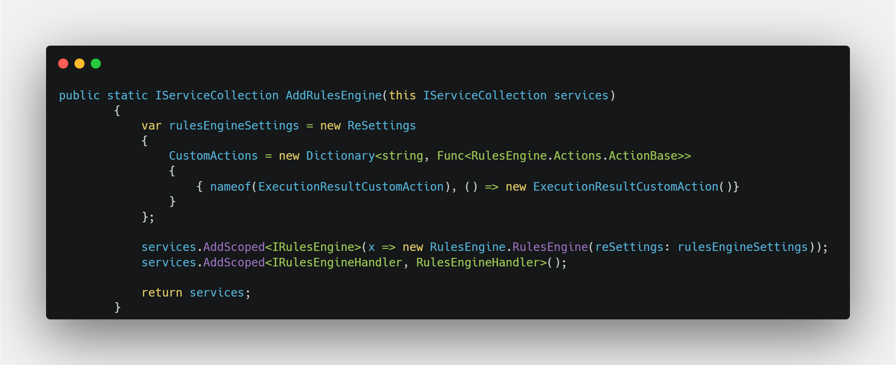
<!-- ```C#
public static IServiceCollection AddBlobRulesStore(this IServiceCollection services)
        {
            services.AddOptions<BlobRulesStoreConfiguration>()
                .Configure<IConfiguration>((settings, config) =>
                {
                    config.GetSection(nameof(BlobRulesStoreConfiguration))
                    .Bind(settings);

                });

            var serviceProvider = services.BuildServiceProvider();

            var blobStoreConfig = (serviceProvider.GetService<IOptions<BlobRulesStoreConfiguration>>())
                .Value;

            services.AddSingleton<BlobContainerClient>(x =>
                new BlobContainerClient(
                    blobContainerName: blobStoreConfig.ContainerName,
                    connectionString: blobStoreConfig.ConnectionString)
            );

            services.AddScoped<IRulesStoreRepository, BlobRulesStoreRepository>();
            return services;
        }
``` -->
<!-- ```C#
public static IServiceCollection AddRulesEngine(this IServiceCollection services)
        {
            var rulesEngineSettings = new ReSettings
            {
                CustomActions = new Dictionary<string, Func<RulesEngine.Actions.ActionBase>>
                {
                    { nameof(ExecutionResultCustomAction), () => new ExecutionResultCustomAction()}
                }
            };

            services.AddScoped<IRulesEngine>(x => new RulesEngine.RulesEngine(reSettings: rulesEngineSettings));
            services.AddScoped<IRulesEngineHandler, RulesEngineHandler>();

            return services;
        }
``` -->

#### Open API Documentation

The AzureFunctions 4.0 supports open api documentation through the use of the [`Microsoft.Azure.WebJobs.Extensions.OpenApi`](https://www.nuget.org/packages/Microsoft.Azure.WebJobs.Extensions.OpenApi) nuget package. The Open API specs are enabled on an Azure function using the decorators on the function signature. The Decorators in this case are shown below.

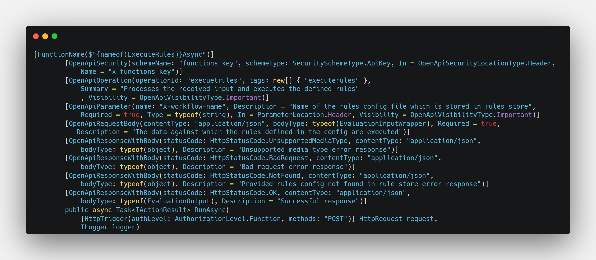
<!-- ```C#
[FunctionName($"{nameof(ExecuteRules)}Async")]
        [OpenApiSecurity(schemeName: "functions_key", schemeType: SecuritySchemeType.ApiKey, In = OpenApiSecurityLocationType.Header,
            Name = "x-functions-key")]
        [OpenApiOperation(operationId: "execuetrules", tags: new[] { "executerules" },
            Summary = "Processes the received input and executes the defined rules"
            , Visibility = OpenApiVisibilityType.Important)]
        [OpenApiParameter(name: "x-workflow-name", Description = "Name of the rules config file which is stored in rules store",
            Required = true, Type = typeof(string), In = ParameterLocation.Header, Visibility = OpenApiVisibilityType.Important)]
        [OpenApiRequestBody(contentType: "application/json", bodyType: typeof(EvaluationInputWrapper), Required = true,
           Description = "The data against which the rules defined in the config are executed")]
        [OpenApiResponseWithBody(statusCode: HttpStatusCode.UnsupportedMediaType, contentType: "application/json",
            bodyType: typeof(object), Description = "Unsupported media type error response")]
        [OpenApiResponseWithBody(statusCode: HttpStatusCode.BadRequest, contentType: "application/json",
            bodyType: typeof(object), Description = "Bad request error response")]
        [OpenApiResponseWithBody(statusCode: HttpStatusCode.NotFound, contentType: "application/json",
            bodyType: typeof(object), Description = "Provided rules config not found in rule store error response")]
        [OpenApiResponseWithBody(statusCode: HttpStatusCode.OK, contentType: "application/json",
            bodyType: typeof(EvaluationOutput), Description = "Successful response")]
        public async Task<IActionResult> RunAsync(
            [HttpTrigger(authLevel: AuthorizationLevel.Function, methods: "POST")] HttpRequest request,
            ILogger logger)
``` -->
The resultant Open API spec looks like follows.


## Testing

Testing the rules engine is very easy. All we need to do is invoke the Functions REST API enpoint and pass it the revelevant data. Following GIF shows a sample testing scenario.

## Pros and Cons of Rules Engine Implementation

### Pros
The advantages of above implementation are noted below

* Since the rules are written using JSON, it becomes very easy for the developers to write these rules
* The updated rules configuration file can be uploaded directly to the Azure Blob Storage without actually touching the azure functions code
* Since the rules can be consumed through the REST API, it is very easy to do Behavior Driven Devlopment of Rules using combination of tool like Specflow and concepts of Unit and Integration Testing
* Since the REST API is deployed on Azure functions platform, we can use the consumption plan to have a dynamic scaling of the rules engine

### Cons

Even though the above implementation of the rules engine comes with many advantages, one major disadvantage of this implementation is *the change in the coding paradigm* It takes some time to learn and adapt to this paradigm of coding as the decision path is not as clearly visible as it is in the imperative model.

## Conclusion

After going through the rules engine implementation, we can conclude that Rules Engine Implementation does provide agility to the organization to implement business process decisions. But, the rules engine needs a careful evaluation as a simple system of rules can be easily developed using the imperative model and maintained accordingly.

## Source Code
The source code for this can be found at [Rules Engine With Azure Functions and Microsoft Rules Engine](https://github.com/codidharma/az-func-bre)