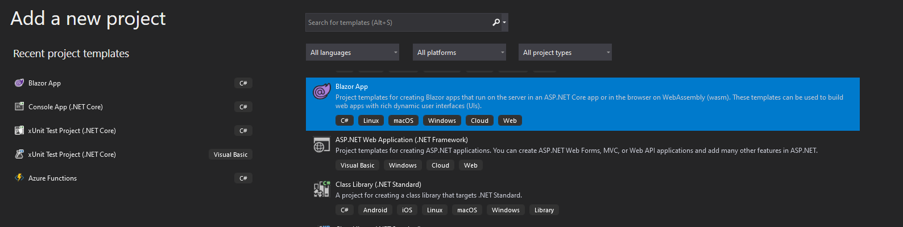
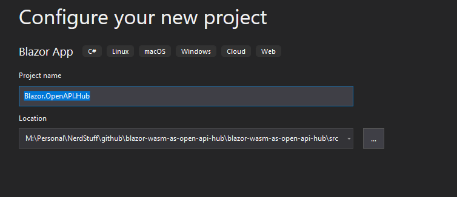
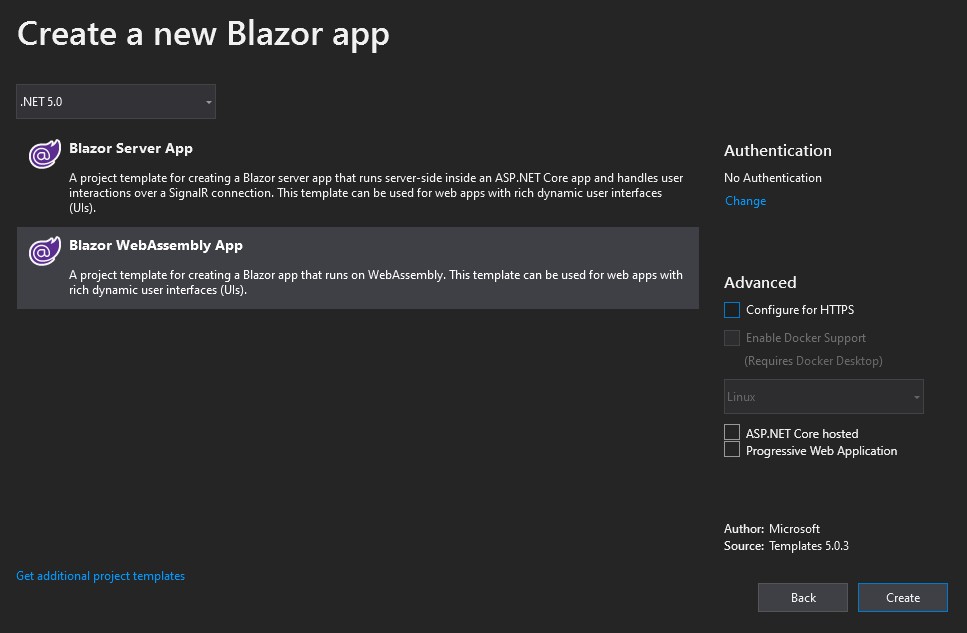
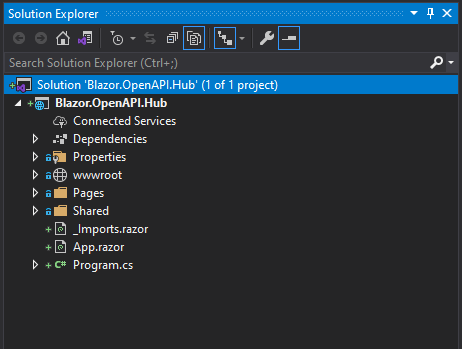
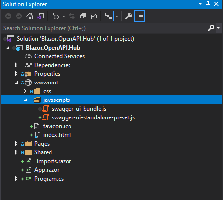
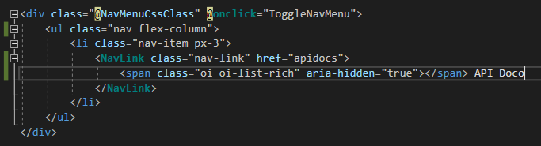
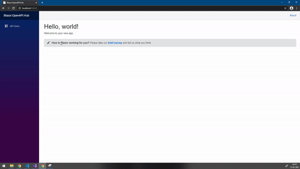
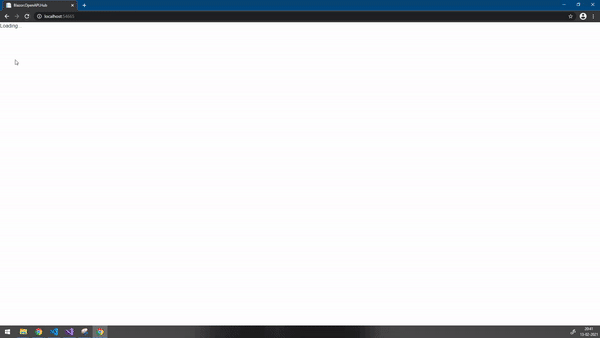

In last few years I have worked on/ seen few projects where there were multiple REST APIS in the enterprise and there was  `Open API` (previously `Swagger`) documentation for each one of them. Creating documentation for your REST APIs is undoubtedly a best practice and every developer worth their salt should adopt this. In cases of microservices architecture, there are always multiple APIS that need to be called from the frontend for the product to deliver the value it should. In such cases having robust documentation always helps. But this creates another problem, as the number of services grow, it becomes a cumbersome task to go to the documentation of each of the service and read it. In such case having a swagger document hub where there is a collection of multiple API definition can definitely add value.

Today I will try to solve this problem by creating an \`Open API\` document using Blazor Web Assembly and SwaggerUI JavaScript. This document hub can be extended to house other important enterprise documentation which teams might need from time to time e.g., production deployment processes, general guidance on repository management etc.

For this demonstration, I am going to use following tech stack

1. Visual Studio 2019 (you can use VS code if you like)
2. .Net Core 5.0

## Creating the Project

We can create the project using the BlazorWebAssembly template available in Visual Studio.







Once done the project structure looks like following.



## Swagger UI JavaScripts

Now we need the javascripts to render the \`OpenAPI\` / \`Swagger\` documentation. Fortunately, we do not need to write these scripts ourselves, these scripts are released on GITHUB for us to use. We can get them from [swagger-api/swagger-ui](https://github.com/swagger-api/swagger-ui) repository. All we need to do is download the latest release from [Swagger UI Latest release](https://github.com/swagger-api/swagger-ui/releases/tag/v3.43.0)

Once this is done, we need to extract out the release and we need to get following three things from the `dist` folder.

1. swagger-ui-bundle.js
2. swagger-ui-standalone-preset.js
3. swagger-ui.css

We can put the javascript files in a seperate folder for javascript in wwwroot folder



Next step is to refer these scripts in the `index.html` page of the blazor application. It can be easily done as follows.

```html
<script src="javascripts/swagger-ui-bundle.js"></script>
<script src="javascripts/swagger-ui-standalone-preset.js"></script>
```

Before we configure the function to render the swagger ui, we need to add few API documentations links in our project (As we will see later, we can directly refer to the documentation using their urls).

I have taken two documents for this demo. I have added

1. Petstorev3.json file which is the `OpenAPI` version
2. Pertstorev2.json file which is the `Swagger` version

Next we add the javascript to load the swagger UI in our `index.html` page. We can also create a new javascript file for this and then refer it in the `index.html`. The javascript looks like following

```html
<script>
        window.buildSwaggerUI = function (domId) {
            // Begin Swagger UI call region
            const ui = SwaggerUIBundle({
                urls: [
                    {
                        url: "apidefinitions/PetStorev2.json",
                        name: "PetStore V2"
                    },
                    {
                        url: "apidefinitions/PetStorev3.json",
                        name: "PetStore V3"
                    }
                ],
                dom_id: domId,
                deepLinking: true,
                presets: [
                    SwaggerUIBundle.presets.apis,
                    SwaggerUIStandalonePreset
                ],
                plugins: [
                    SwaggerUIBundle.plugins.DownloadUrl
                ],
                layout: "StandaloneLayout"
            })
            
            window.ui = ui
        }
    </script>
```

Next lets add the pane to render the swagger UI. This can be done by adding a new page called `APIDocs.razor` to the pages folder. Now we want to render the swagger UI once the div component is rendered on the page. We do this by overriding the method as shown below.

```razor
@page "/apidocs"
@inject IJSRuntime JSR

<div id="swagger-ui"></div>
@code
{
    protected override async Task OnAfterRenderAsync(bool firstRender)
    {
        await JSR.InvokeVoidAsync("buildSwaggerUI");
    }}
```

Next we update the \`navMenu.razor\` to add the link to the \`A\`PIDOcs.razor page that we created. It looks as below.



Now we run the Blazor application. It is rendered as follows.



There is one glaring problem with this, there is no styling applied!

We will now apply the css that we retrieved from the release. All we need to do is add the content of the \`swagger-ui-css\` file to the \`app.css\` file located under \`wwwroot/css\` folder. The result after adding the css is as below.



 Yeah it Works!!

## Wrapup
We saw how easy it is to integrate the SwaggerUI in a blazor application. The only problem I see in this approach is that we have to manually copy the javascripts from the `SwaggerUI` repository to make them work for us. There are other configurations like setting up CORS etc that I have not touched upon but you are free to explore them. The documentation if available on the repository that I pointed to earlier on.
