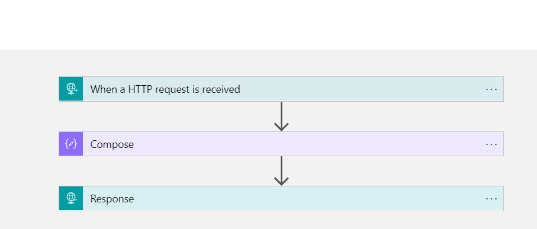
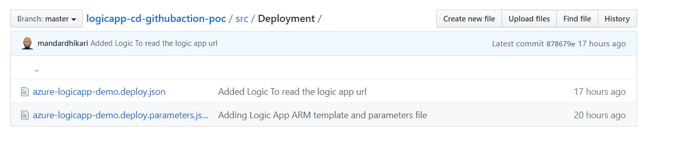

I have been examining GITHUB actions for last few days and I decided to try out a few workflows myself to learn how the CI CD process is implemented using them. In this post I will examine mostly on how to deploy a Logic App to a resources group and test it after the deployment. What follows now is the basest of the scenario which I used to understand the GITHUB actions.

Last few months there has been an increase in chatter over the internet around GITHUB actions so let us answer the question.

# What are GitHub actions?

GITHUB actions are the workflows that allow use to perform a set of actions when certain events occur on the repository. An event on repository can be as simple as "when a push is made to master branch" or "A pull request is raised on master branch". GITHUB allows us to automate certain responses to these events using automated workflows called as GitHub actions. These actions react to one or multiple events and perform certain tasks e.g. "Build and Run the tests", "Deploy the code", "Merge the code from one branch to another". This is kind of a reactive programming approach where when a developer or admin performs some action on the repository, the GITHUB action reacts to that and performs something.

We can build our end-to-end continuous integration (CI) and deployment (CD) for the code in the repository directly in the GITHUB. The great thing that I find about GITHUB actions is that there are lot of actions are available out of box for us and there are some custom ones developed and shared by the community which we can implement in our code.

Following terminology will come handy later during the post.

1. [Workflow](https://help.github.com/en/actions/getting-started-with-github-actions/core-concepts-for-github-actions#workflow,"Workflow"): This is the automated process which will be run and can perform various tasks like builing, testing, publishing, deploying the code in the GitHub repository.
2. [Runners](https://help.github.com/en/actions/getting-started-with-github-actions/core-concepts-for-github-actions#runner, "Runners"): Runners are the machines on which the workflows are executed. These runners can be either the default runners hosted by GitHub or you can use your own hosted runners.
3. [Job](https://help.github.com/en/actions/getting-started-with-github-actions/core-concepts-for-github-actions#job,"Job"): Job is a set of steps that are executed on the same runner. It is there fore important for us to understand that all the processes that need datat sharing must be clubbed under same job.
4. [Action](https://help.github.com/en/actions/getting-started-with-github-actions/core-concepts-for-github-actions#action, "Action"): Actions are the individual steps that are defined under a job.

You can read more about the GITHUB actions at [About GITHUB Actions](https://help.GITHUB.com/en/actions/getting-started-with-GITHUB-actions/about-GITHUB-actions "About GITHUB Actions")

# Scenario

For the purpose of this post, I have created a simple HTTP triggered logic app which accepts following input

```Json
{
"FirstName": "Jon",
"LastName": "Snow"
}
```

and returns following response

```Json
{
    "FirstName": "Jon",
    "FullName": "Jon Snow",
    "LastName": "Snow"
}
```

The logic app is very simple as shown below.



```Json
{
  "$schema": "https://schema.management.azure.com/schemas/2019-04-01/deploymentTemplate.json#",
  "contentVersion": "1.0.0.0",
  "parameters": {
    "LogicAppLocation": {
      "type": "string",
      "minLength": 1,
      "allowedValues": [
        "australiaeast",
        "australiasoutheast"
      ]
      
    },
    "LogicAppName": {
      "type": "string",
      "minLength": 1
      
    }
  },
  "variables": {},
  "resources": [
    {
      "properties": {
        "state": "Enabled",
        "definition": {
          "$schema": "https://schema.management.azure.com/providers/Microsoft.Logic/schemas/2016-06-01/workflowdefinition.json#",
          "actions": {
            "Compose": {
              "type": "Compose",
              "inputs": "@concat(triggerBody()?['FirstName'],' ',triggerBody()?['LastName'])",
              "runAfter": {}
            },
            "Response": {
              "type": "Response",
              "kind": "Http",
              "inputs": {
                "statusCode": 200,
                "headers": {
                  "Content-Type": "application/json"
                },
                "body": {
                  "FirstName": "@triggerBody()?['FirstName']",
                  "FullName": "@outputs('Compose')",
                  "LastName": "@triggerBody()?['LastName']"
                }
              },
              "runAfter": {
                "Compose": [
                  "Succeeded"
                ]
              }
            }
          },
          "parameters": {},
          "triggers": {
            "manual": {
              "type": "Request",
              "kind": "Http",
              "inputs": {
                "schema": {
                  "properties": {
                    "FirstName": {
                      "type": "string"
                    },
                    "LastName": {
                      "type": "string"
                    }
                  },
                  "type": "object"
                }
              }
            }
          },
          "contentVersion": "1.0.0.0",
          "outputs": {}
        },
        "parameters": {}
      },
      "name": "[parameters('LogicAppName')]",
      "type": "Microsoft.Logic/workflows",
      "location": "[parameters('LogicAppLocation')]",
      "tags": {
        "displayName": "LogicApp"
      },
      "apiVersion": "2016-06-01"
    }
  ],
  "outputs": {
     "logicAppUrl": {
      "type": "string",
      "value": "[listCallbackURL(concat(resourceId('Microsoft.Logic/workflows/', parameters('LogicAppName')), '/triggers/manual'), '2016-06-01').value]"
   }
  }
}
```

The parameters file associated with this is as following.

```Json
{
    "$schema": "https://schema.management.azure.com/schemas/2019-04-01/deploymentParameters.json#",
    "contentVersion": "1.0.0.0",
    "parameters": {
      "LogicAppName": {
        "value": "az-httplogicapp-prod"
      },
      "LogicAppLocation": {
        "value": "australiaeast"
      }
    }
  }
```

These templates are checked into the repository as shown below.

